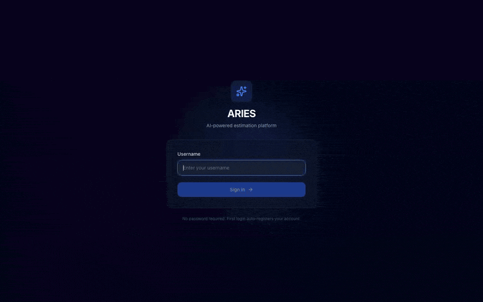

# ARIES v2.0

**AI Resource & Intelligent Estimation System**

> Turn a BRD into a complete project estimate in under 2 minutes — powered by 9 AI agents working in a visual pipeline.

[](LICENSE)
[](https://python.org)
[](https://nodejs.org)



---

## What is ARIES?

Enterprise software teams spend **2–4 weeks** manually estimating projects — reading BRDs, cross-referencing history, applying rate cards, building schedules, writing reports. It's slow, inconsistent, and error-prone.

**ARIES** runs 9 specialized AI agents in a configurable drag-and-drop pipeline. Upload a document, choose your workflow, and get a complete estimate (phases, effort hours, costs, resources, schedule, risks) — automatically.

### Key Features

- **Visual Pipeline Builder** — drag-and-drop canvas (React Flow) with 28 node types across 6 categories
- **9 AI Agents** — each with a distinct "soul" (personality, expertise, tools, memory access)
- **5-Layer Memory System** — with Ebbinghaus decay for learning across estimates
- **5 Workflow Templates** — Quick, Standard, Enterprise, Re-Estimate, Jira
- **Built-in Validation** — MAP framework, quality gates, full audit trail
- **Configurable LLM Providers** — OpenAI, Anthropic, GitHub Models, or fully local via Ollama
- **Pure TypeScript NLP** — TF-IDF, cosine similarity, domain detection — zero ML dependencies
- **Zero Licensing Cost** — fully open-source stack
- **Single Command** — `python run.py` serves everything on port 8000

---

## Quick Start

### Prerequisites

- **Python 3.10+**
- **Node.js 18+** (for frontend development)
- An LLM provider (see options below)

### Option A: Cloud LLM Provider

Use any of: OpenAI, Anthropic, or GitHub Models.

```bash
git clone https://github.com/parallelromb/aries-v2.git
cd aries-v2

# Copy and configure environment
cp .env.example .env
# Edit .env — set your preferred LLM provider and API key

# Install Python dependencies
pip install -r requirements.txt

# Launch (serves frontend + API on port 8000)
python run.py
```

Open [http://localhost:8000](http://localhost:8000) and log in with any username.

### Option B: Fully Local with Ollama

Run completely offline with no API keys. Requires **16 GB+ RAM** for larger models.

```bash
# 1. Install Ollama (macOS, Linux, or Windows)
# macOS:
brew install ollama
# Linux:
curl -fsSL https://ollama.com/install.sh | sh

# 2. Pull a model
ollama pull gemma3:27b    # Best quality — needs 16 GB+ RAM
# OR
ollama pull gemma3:12b    # Good balance — needs 8 GB+ RAM
# OR
ollama pull gemma3:4b     # Lightweight — runs on 4 GB+

# 3. Start Ollama (runs on port 11434)
ollama serve

# 4. Clone and configure ARIES
git clone https://github.com/parallelromb/aries-v2.git
cd aries-v2
cp .env.example .env
# Edit .env:
#   LLM_PROVIDER=ollama
#   OLLAMA_HOST=http://localhost:11434
#   OLLAMA_MODEL=gemma3:27b

pip install -r requirements.txt
python run.py
```

### Hardware Guidance (for local Ollama)

| Model | Min RAM | Recommended For |
|-------|---------|-----------------|
| `gemma3:27b` | 16 GB | Full accuracy — desktops, workstations, cloud VMs |
| `gemma3:12b` | 8 GB | Good balance — most laptops and small VMs |
| `gemma3:4b` | 4 GB | Quick iteration — constrained environments |

ARIES is platform-agnostic: macOS, Linux, Windows (WSL2), or any cloud VM.

---

## Architecture

```
┌─────────────────────────────────────────────────────┐
│                    Browser (SPA)                     │
│  React + Vite + Tailwind + React Flow + Zustand     │
│  ┌───────────┐ ┌──────────┐ ┌────────────────────┐  │
│  │ Pipeline  │ │ NLP      │ │ Pipeline Executor  │  │
│  │ Builder   │ │ Engine   │ │ (topological sort) │  │
│  └───────────┘ └──────────┘ └────────────────────┘  │
└──────────────────────┬──────────────────────────────┘
                       │ REST + WebSocket
┌──────────────────────▼──────────────────────────────┐
│              FastAPI Backend (port 8000)              │
│  ┌──────────┐ ┌──────────┐ ┌───────────────────┐    │
│  │ Auth     │ │ 60+ API  │ │ Agentic Layer     │    │
│  │ (cookie) │ │ Endpoints│ │ 9 agents, orchest.│    │
│  └──────────┘ └──────────┘ └───────────────────┘    │
│  ┌──────────┐ ┌──────────┐ ┌───────────────────┐    │
│  │ SQLite   │ │ Memory   │ │ LLM Router        │    │
│  │ (WAL)    │ │ 5 layers │ │ OpenAI/Anthropic/ │    │
│  └──────────┘ └──────────┘ │ GitHub/Ollama     │    │
│                             └───────────────────┘    │
└──────────────────────────────────────────────────────┘
```

## AI Agents

| Agent | Role | Expertise |
|-------|------|-----------|
| **ARIA** | Requirements Analyst | Extract & structure requirements, gap analysis |
| **NOVA** | Estimation Engine | Generate effort/cost/resource estimates |
| **SENTINEL** | Security Reviewer | Identify security risks & compliance issues |
| **ATLAS** | Architecture Advisor | Evaluate technical architecture implications |
| **CHRONOS** | Schedule Planner | Build timelines, identify critical paths |
| **ORACLE** | Historical Analyst | Cross-reference past estimates & outcomes |
| **NEXUS** | Integration Specialist | Assess integration complexity & dependencies |
| **PRISM** | Quality Analyst | Define quality gates & testing strategies |
| **FORGE** | DevOps Advisor | Infrastructure, CI/CD, deployment planning |

## Pipeline Node Types (28)

**Input Sources** (4) — Document Upload, API Input, Jira Import, Manual Entry
**AI Agents** (8) — One per agent + composite node
**Tools** (4) — Rate Card, Calendar, Template, Export
**Processing** (4) — Decision Gate, Checkpoint, Merge, Filter
**Output** (4) — Report, Dashboard, Excel, HTML
**Optimize** (4) — Cache, Parallel, Retry, Validate

## Memory System

5-layer memory with Ebbinghaus decay:

| Layer | Purpose | Decay Rate |
|-------|---------|------------|
| **Working** | Current session context | None (session-scoped) |
| **Short-term** | Recent estimates & patterns | Fast (hours) |
| **Long-term** | Historical outcomes & learnings | Slow (weeks) |
| **Semantic** | Domain knowledge & relationships | Very slow (months) |
| **Episodic** | Specific event recall | Medium (days) |

---

## Configuration

All configuration is in `.env`. See `.env.example` for the full list (16 variables).

Key settings:

```env
# LLM Provider: openai | anthropic | github | ollama
LLM_PROVIDER=ollama
LLM_API_KEY=your-key-here        # Not needed for Ollama

# Ollama settings (only when LLM_PROVIDER=ollama)
OLLAMA_HOST=http://localhost:11434
OLLAMA_MODEL=gemma3:27b

# Server
PORT=8000
HOST=0.0.0.0

# Auth
SESSION_TTL_HOURS=24
```

---

## Development

```bash
# Frontend dev (hot reload)
cd frontend
npm install
npm run dev          # Vite dev server on port 5173

# Backend dev
pip install -r requirements.txt
uvicorn server.app:app --reload --port 8000

# Build for production
cd frontend && npm run build    # outputs to static/dist/
python run.py                   # serves SPA + API on port 8000
```

---

## Project Structure

```
aries-v2/
├── frontend/src/              # React app
│   ├── routes/                # 7 page components
│   ├── components/            # UI + pipeline + dashboard
│   ├── stores/                # 5 Zustand stores
│   ├── lib/                   # Pipeline executor, NLP, node registry
│   ├── services/              # LLM chat API
│   └── types/                 # TypeScript interfaces
├── server/                    # FastAPI backend
│   ├── app.py                 # Main app
│   ├── routes/                # 13 route files (60+ endpoints)
│   └── services/              # Store, auth, memory
├── backend/                   # Agentic AI layer
│   ├── agents/souls/          # 9 agent YAML definitions
│   ├── agents/skills/         # 13 skill pack YAMLs
│   ├── orchestrator/          # Pipeline engine
│   └── services/              # Chat, export, bridge
├── data/                      # SQLite DB + uploads
├── static/dist/               # Built SPA
├── .env.example               # Environment template
├── requirements.txt           # Python dependencies
└── run.py                     # Entry point
```

---

## Workflow Templates

| Template | Agents Used | Best For |
|----------|-------------|----------|
| **Quick Estimate** | ARIA → NOVA | Fast ballpark from a short doc |
| **Standard** | ARIA → NOVA → CHRONOS → PRISM | Full estimate with schedule |
| **Enterprise** | All 9 agents | Large, complex, multi-team projects |
| **Re-Estimate** | ORACLE → NOVA → SENTINEL | Revising an existing estimate |
| **Jira Import** | Jira Input → ARIA → NOVA → CHRONOS | Estimate from Jira tickets |

---

## Smara Integration

ARIES uses [Smara](https://github.com/parallelromb/smara) for persistent cross-session memory. Smara provides the memory API that powers the 5-layer memory system, enabling agents to learn from past estimates and improve over time.

---

## License

MIT License. See [LICENSE](LICENSE) for details.

---

Built with Claude Code | ARIES v2.0 | MIT License
